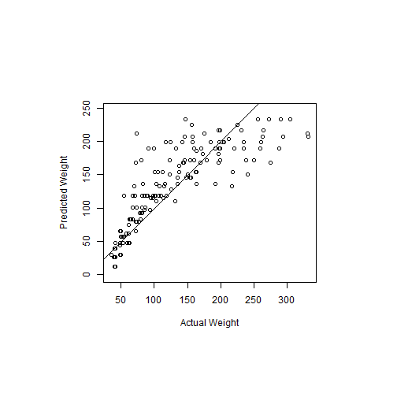

## Introduction

This shiny app was developed using the ChickWeight dataset.  It allows the user to input the experimental Diet their chick is currently on (1-4), it's age in days and optionally input the chick's actual weight in grams.  The app then predicts what the chick's weight should be and if the chick's actual weight was input then determines whether the chick is underweight or overweight.

---
## Model


```r
library(caret)
data(ChickWeight)
set.seed(208)
inTrain <- createDataPartition(ChickWeight$weight, p=0.7, list = FALSE)
training <- ChickWeight[inTrain, ]
testing <- ChickWeight[-inTrain, ]
modelFit <- train(weight ~ Diet + Time, method = "glm", data=training)
```
The prediction model was based on a generalized linear model.  The model has a root mean square error of 34.5421176 and an r-squared value of 0.7624488.

---
## Model Predictions

This plot shows the predicted weights on the y-axis and the actual weights of the test partition of the ChickWeight dataset on the x-axis.  As you can see, the model could be a bit better but it will suffice for our usage.

 

---
## App

The Chick Weight predictor shiny app can be found [here] (http://jmjwen.shinyapps.io/ChickWeightPredictor).
